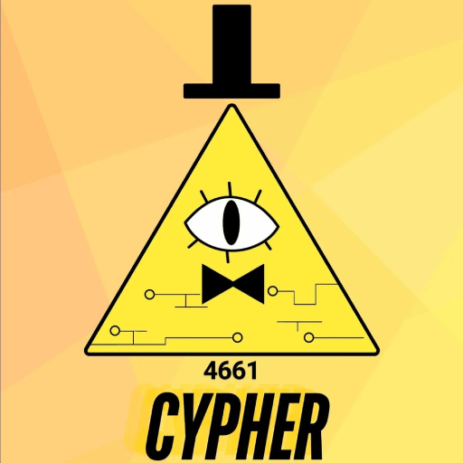

<table>
<tr>
<td>

# 🛰️ Cypher 4661 Scouting Web-Only 2026

A fast, lightweight **robotics competition scouting system** built with **Flutter Web**.

Cypher Scouting helps teams **capture match data, analyze team performance, and generate strategic insights** during competitions.

Built for **Cypher teams – 2026**

</td>
<td align="right">



</td>
</tr>
</table>

---

## 🚀 Live Demo

🌐 https://cypherscouting.netlify.app/

Try the deployed version to see the scouting interface in action.

---

## 📊 What is Cypher Scouting?

**Cypher Scouting** is a scouting platform designed for robotics competitions such as **FRC**.  
It allows teams to efficiently collect and analyze match data in real time.

### Key Capabilities

- 📋 Match performance tracking  
- 📈 Team statistics collection  
- 🤖 Strategy insights for alliance selection  
- ⚡ Fast scouting workflow optimized for competitions  

The application runs completely inside the browser using **Flutter Web**.

---
## 📱 Add to Home Screen (Mobile)

Even though this is a web app, you can install it on your phone like a normal app.

### iPhone / iPad (Safari)

1. Open the website in **Safari**  
2. Tap the **Share button** (square with arrow)  
3. Scroll down and tap **"Add to Home Screen"**  
4. Press **Add**

The Cypher Scouting app will now appear on your home screen and will now launch in **full-screen mode** like a normal app.

---

### Android (Chrome)

1. Open the website in **Chrome**
2. Tap the **three dots menu** in the top right
3. Tap **"Add to Home screen"**
4. Confirm by pressing **Add**

The Cypher Scouting app will now appear on your home screen and will now launch in **full-screen mode** like a normal app.

---

## 📣 Project Highlights

⭐ Single-page Flutter web application  
⭐ Optimized for fast scouting during competitions  
⭐ Runs completely in the browser  
⭐ Designed for robotics scouting workflows  

---

## 📦 Repository Contents

This repository contains **only the compiled web output** from the Flutter project.

```
index.html
main.dart.js
flutter.js
flutter_bootstrap.js
flutter_service_worker.js
manifest.json
version.json
assets/
icons/
canvaskit/
```

### Important

This repository **does not contain the Flutter source code**.

If you want to modify the application behavior, you must edit the original Flutter project and rebuild the web version.

---

## 🌎 Supported Platforms

Best experience on modern **desktop browsers**:

- Chrome
- Edge
- Firefox
- Safari


---

---

## 🛠️ For Contributors

This repository contains **compiled assets only**.

To change the application:

1. Edit the original Flutter project
2. Build the web version

```bash
flutter build web
```

3. Replace the files in this repository
4. Commit and redeploy

Remember to update:

- `version.json`
- asset hashes

---

## 🧩 Tech Stack

- Flutter Web
- CanvasKit Renderer
- Static Hosting (Netlify / GitHub Pages / Vercel)

---

## ❤️ Credits

Made with ❤️ for **Cypher Robotics Teams**

**Cypher Scouting Web-Only — 2026**